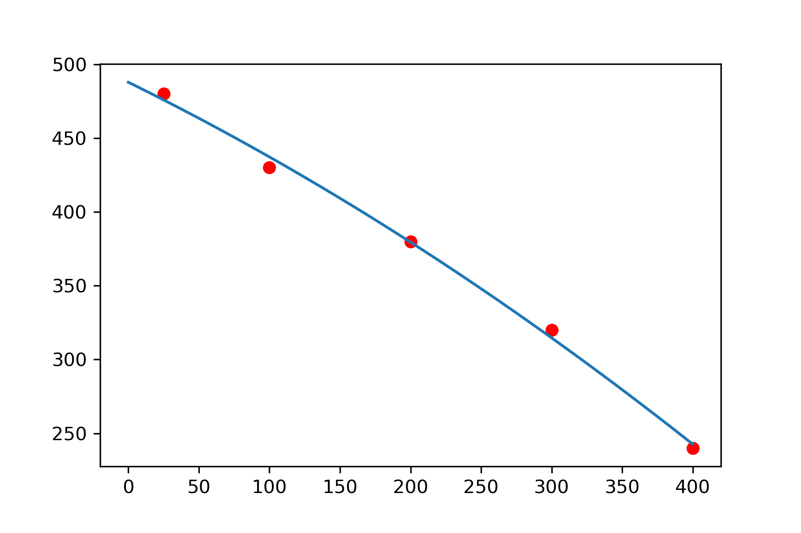

# Zircaloy-4 Mechanical Properties Analysis

## Objective

Study the variation of Zircaloy-4 yield strength with temperature.

## Dataset

| Temperature (°C) | Yield Strength (MPa) |
|-----------------|---------------------|
| 25 | 480 |
| 100 | 430 |
| 200 | 380 |
| 300 | 320 |
| 400 | 240 |

## Tools

- Python
- Pandas
- NumPy
- Matplotlib

## Results

The yield strength decreases as temperature increases.

### Strength vs Temperature

## Conclusions

- Mechanical strength decreases with temperature.
- The trend can be approximated using a second-order polynomial fit.
- The workflow demonstrates basic engineering data analysis using Python.

The observed reduction in yield strength is consistent with the increased atomic mobility and reduced resistance to dislocation motion at elevated temperatures.

This behavior is particularly relevant for zirconium alloys used in nuclear fuel cladding.

## Skills Demonstrated

- Data analysis with Pandas
- Numerical fitting with NumPy
- Scientific visualization with Matplotlib
- Engineering data interpretation
- Git and GitHub workflow